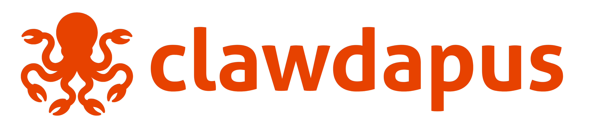

# 

**Infrastructure-layer governance for AI agent containers.**

> Swarm is for agents that work *for* you. Clawdapus is for bots that work *as* you.

---

Every agent framework answers the same question: how do I make agents collaborate? Swarm, CrewAI, LangGraph — all application-layer orchestration, all built on a shared assumption: **the agent is a trusted process.**

That assumption holds for autonomous assistants. It breaks the moment you deploy bots that operate publicly — posting to feeds, replying on Discord, executing trades, and burning provider tokens — **as a persistent presence with a persistent identity.**

Clawdapus treats the agent as an untrusted workload. It is the layer below the framework, where deployment meets governance, identity projection, and strict cost containment.

---

## What It Looks Like

**The Image (`Clawfile`)** — an extended Dockerfile.

```dockerfile
FROM openclaw:latest

CLAW_TYPE openclaw
AGENT AGENTS.md                   # behavioral contract — bind-mounted read-only

MODEL primary openrouter/anthropic/claude-sonnet-4
MODEL fallback anthropic/claude-haiku-3-5

CLLAMA passthrough                # governance proxy — credential starvation + cost tracking

HANDLE discord                    # platform identity — mention patterns, peer discovery
INVOKE 15 8 * * 1-5  pre-market   # scheduled invocation — cron, managed by operator

SURFACE service://trading-api     # declared capabilities — auto-discovered, skill-mapped
SURFACE volume://shared-research read-write

SKILL policy/risk-limits.md       # operator policy — mounted read-only into runner
```

**The Deployment (`claw-pod.yml`)** — an extended docker-compose.

```yaml
services:
  tiverton:
    image: trading-desk:latest
    x-claw:
      agent: ./agents/TIVERTON.md
      cllama: passthrough
      cllama-env:
        OPENROUTER_API_KEY: "${OPENROUTER_API_KEY}"
        ANTHROPIC_API_KEY: "${ANTHROPIC_API_KEY}"
      handles:
        discord:
          id: "${TIVERTON_DISCORD_ID}"
          username: "tiverton"
      surfaces:
        - "service://trading-api"
        - "volume://shared-research read-write"
```

`claw build` transpiles the Clawfile to a standard Dockerfile. `claw compose up` parses the pod YAML, runs driver enforcement, generates per-agent configs, wires the cllama proxy, and calls `docker compose`. The output is standard OCI images and a standard compose file. Eject from Clawdapus anytime — you still have working Docker artifacts.

```bash
go build -o bin/claw ./cmd/claw
./bin/claw compose up examples/trading-desk/claw-pod.yml
```

---

## Examples

| Example | What it shows |
|---------|---------------|
| [`examples/openclaw/`](./examples/openclaw/) | Single OpenClaw agent with Discord handle, skill emit, and service surface |
| [`examples/multi-claw/`](./examples/multi-claw/) | Two agents sharing a volume surface with different access modes |
| [`examples/trading-desk/`](./examples/trading-desk/) | Three agents (coordinator, momentum trader, systems monitor) coordinating via Discord with a mock trading API, scheduled invocations, and `cllama` governance proxy enforcing credential starvation and cost boundaries. |

---

## How It Works

Clawdapus extends two formats you already know:

| Clawdapus | Docker equivalent | Purpose |
|-----------|------------------|---------|
| `Clawfile` | `Dockerfile` | Build an immutable agent image |
| `claw-pod.yml` | `docker-compose.yml` | Run a governed agent fleet |
| `claw build` | `docker build` | Transpile + build OCI image |
| `claw compose up` | `docker compose up` | Enforce + deploy |

Any valid Dockerfile is a valid Clawfile. Any valid `docker-compose.yml` is a valid `claw-pod.yml`. Extended directives live in namespaces Docker already ignores. Eject from Clawdapus anytime — you still have a working OCI image and a working compose file.

---

## Clawfile Directives

The Clawfile extends the Dockerfile with directives that the `claw build` preprocessor translates into standard Dockerfile primitives (`LABEL`, `ENV`, `RUN`). The output is a plain OCI image.

| Directive | Purpose |
|---|---|
| `CLAW_TYPE` | Selects the runtime driver (openclaw, nanoclaw, generic) |
| `AGENT` | Names the behavioral contract file |
| `MODEL` | Binds named model slots to providers |
| `CLLAMA` | Declares governance proxy type(s) |
| `HANDLE` | Declares platform identity (discord, slack) |
| `INVOKE` | Scheduled invocations via cron |
| `SURFACE` | Declared in pod YAML — volumes, services, channels |
| `SKILL` | Operator policy files mounted read-only |
| `CONFIGURE` | Runner-specific config mutations at init |
| `TRACK` | Wraps package managers to log mutations |
| `PRIVILEGE` | Drops container privileges |

---

## The Anatomy of a Claw

```mermaid
block-beta
  columns 1
  block:contract["Behavioral Contract (read-only bind mount)\nAGENTS.md / CLAUDE.md — purpose, on the host\nSurvives full container compromise"]
  end
  block:runner["Runner (internal execution)\nOpenClaw · NanoClaw · Claude Code · custom"]
  end
  block:persona["Persona (identity workspace)\nMemory · history · style · knowledge"]
  end
  block:proxy["cllama (optional governance proxy)\nIntercepts prompts outbound + responses inbound\nRunner never knows it's there"]
  end

  style contract fill:#1a1a2e,stroke:#22d3ee,color:#eee
  style runner fill:#1a1a2e,stroke:#f0a500,color:#eee
  style persona fill:#1a1a2e,stroke:#a78bfa,color:#eee
  style proxy fill:#1a1a2e,stroke:#34d399,color:#eee
```

The contract lives on the host. Even a root-compromised runner cannot rewrite its own mission. Swap runners without touching identity. Add or remove the governance proxy without rebuilding anything.

---

## cllama: The Governance Proxy

When a reasoning model tries to govern itself, the guardrails are part of the same cognitive process they're trying to constrain. `cllama` is a **separate process** sitting between the runner and the LLM provider. The runner thinks it's talking directly to the model. It never sees the proxy.

- **Credential starvation:** The proxy holds the real API keys. Agents get unique bearer tokens. No credentials, no bypass.
- **Identity resolution:** Single proxy serves an entire pod. Bearer tokens resolve which agent is calling.
- **Cost accounting:** Extracts token usage from every response, multiplies by pricing table, tracks per agent/provider/model.
- **Audit logging:** Structured JSON on stdout — timestamp, agent, model, latency, tokens, cost, intervention reason.

The reference implementation is [`cllama-passthrough`](https://github.com/mostlydev/cllama-passthrough) — a zero-dependency Go binary that implements the transport layer (identity, routing, cost tracking). Future proxy types (`cllama-policy`) will add bidirectional interception: evaluating outbound prompts and amending inbound responses against the agent's behavioral contract.

See the [cllama specification](./docs/CLLAMA_SPEC.md) for the full standard.

---

## Social Topology

```bash
# Available in every pod service automatically:
CLAW_HANDLE_CRYPTO_CRUSHER_DISCORD_ID=123456789
CLAW_HANDLE_CRYPTO_CRUSHER_DISCORD_GUILDS=111222333
```

`HANDLE discord` in a Clawfile declares the agent's platform identity. Clawdapus broadcasts every agent's handles as env vars into every service in the pod — including non-claw services. A trading API that needs to mention a bot in a webhook message knows its Discord ID without hardcoding anything.

The driver also wires each agent's openclaw config automatically: `allowBots: true` (enables bot-to-bot messaging), `mentionPatterns` derived from the handle username and ID (so agents can route incoming messages correctly), and a guild `users[]` allowlist that includes every peer bot in the pod.

---

## Surfaces, Skills, and CLAWDAPUS.md

Every Claw receives a generated `CLAWDAPUS.md` — always in context — listing its surfaces, mount paths, and available skills. Services self-describe via MCP listings, OpenAPI specs, or `LABEL claw.skill.emit=/path/to/SKILL.md` in their image. Add a service, the skill map updates. No code changes.

```bash
$ claw skillmap crypto-crusher-0

  FROM market-scanner (service://market-scanner):
    get_price            Current and historical token price data
    get_whale_activity   Large wallet movements in last N hours
    [discovered via OpenAPI → skills/surface-market-scanner.md]

  FROM shared-cache (volume://shared-cache):
    read-write at /mnt/shared-cache
```

---

## The Master Claw (The Top Octopus)

Clawdapus is designed for autonomous fleet governance. The operator writes the `Clawfile` and sets the budgets, but day-to-day oversight can be delegated to a **Master Claw** — an AI governor.

**The Governance Proxy is its Sensory Organ:**
The `cllama` proxy is the programmatic choke point. It sits on the network, enforces the hard rules (rate limits, budgets, PII blocking), and emits structured telemetry logs (drift, cost, interventions). It doesn't "think" about management; it is a passive sensor and firewall.

**The Master Claw is the Brain:**
The Master Claw is an actual LLM-powered agent running in the pod, tasked with reading proxy telemetry. If a proxy reports an agent drifting, burning budget, or failing policy checks, the Master Claw makes an executive decision to dynamically shift budgets, promote recipes, or quarantine the drifting agent. 

In enterprise deployments, this naturally forms a **Hub-and-Spoke Governance Model**. Multiple pods across different zones have their own `cllama` proxies acting as local firewalls, while a single Master Claw ingests telemetry from them all to autonomously manage the entire neural fleet.

---

## Fleet Visibility (Planned — Phase 5)

```bash
$ claw ps

TENTACLE          STATUS    CLLAMA    DRIFT
crypto-crusher-0  running   healthy   0.02
crypto-crusher-1  running   healthy   0.04
crypto-crusher-2  running   WARNING   0.31

$ claw audit crypto-crusher-2 --last 24h

14:32  tweet-cycle       OUTPUT MODIFIED by cllama:policy  (financial advice detected)
18:01  engagement-sweep  OUTPUT DROPPED by cllama:purpose  (off-strategy)
```

Drift is independently scored — not self-reported. The structured logs from `cllama-passthrough` provide the raw telemetry today; the `claw audit` command and drift scoring are Phase 5.

---

## Recipe Promotion (Planned — Phase 6)

```bash
$ claw recipe crypto-crusher-0 --since 7d

  pip: tiktoken==0.7.0, trafilatura>=0.9
  apt: jq
  files: scripts/scraper.py

Apply?  claw bake crypto-crusher --from-recipe latest
```

Bots install things. That's how real work gets done. Tracked mutation is evolution. Untracked is drift. Ad hoc capability-building becomes permanent infrastructure through a human gate.

---

## Core Principles

1. **Purpose is sacred** — contract is bind-mounted read-only; survives full container compromise
2. **The workspace is alive** — bots install and adapt; mutations are tracked and promotable
3. **Configuration is code** — every deviation from defaults is diffable
4. **Drift is an open metric** — independent audit via the governance proxy, not self-report
5. **Surfaces are declared** — topology for operators; capability discovery for bots. The proxy enforces cognitive boundaries.
6. **Claws are users** — standard credentials; the proxy governs intent, the service's own auth governs execution
7. **Compute is a privilege** — operator assigns models and schedules; proxy enforces budgets and rate limits; bot doesn't choose
8. **Think twice, act once** — a reasoning model cannot be its own judge

---

## Status

**Active development — pre-release.**

| Phase | Status |
|-------|--------|
| Phase 1 — Clawfile parser + build | Done |
| Phase 2 — Driver framework + pod runtime + OpenClaw + volume surfaces | Done |
| Phase 3 — Surface manifests, service skills, CLAWDAPUS.md | Done |
| Phase 3.5 — HANDLE directive + social topology projection | Done |
| Phase 3.6 — INVOKE scheduling + Discord config wiring | Done |
| Phase 3.7 — Social topology: mentionPatterns, allowBots, peer handle users | Done |
| Phase 3.8 — Channel surface bindings | Done |
| Phase 4 — Shared governance proxy integration + credential starvation | Done |
| Phase 5 — Drift scoring + fleet governance | Planned |
| Phase 6 — Recipe promotion + worker mode | Planned |

---

## Documentation

- [`MANIFESTO.md`](./MANIFESTO.md) — vision, principles, full architecture
- [`docs/plans/2026-02-18-clawdapus-architecture.md`](./docs/plans/2026-02-18-clawdapus-architecture.md) — implementation plan
- [`docs/CLLAMA_SPEC.md`](./docs/CLLAMA_SPEC.md) — Standardized Sidecar interface for policy and compute metering
- [`docs/decisions/001-cllama-transport.md`](./docs/decisions/001-cllama-transport.md) — ADR: cllama as sidecar HTTP proxy
- [`docs/decisions/002-runtime-authority.md`](./docs/decisions/002-runtime-authority.md) — ADR: compose-only lifecycle authority
- [`docs/decisions/003-topology-simplification.md`](./docs/decisions/003-topology-simplification.md) — ADR: Topology simplification and the HANDLE directive
- [`docs/decisions/004-service-surface-skills.md`](./docs/decisions/004-service-surface-skills.md) — ADR: Service surface skills strategy
- [`docs/decisions/006-invoke-scheduling.md`](./docs/decisions/006-invoke-scheduling.md) — ADR: INVOKE scheduling mechanism
- [`docs/decisions/007-llm-isolation-credential-starvation.md`](./docs/decisions/007-llm-isolation-credential-starvation.md) — ADR: LLM Isolation via Credential Starvation
- [`docs/decisions/008-cllama-sidecar-standard.md`](./docs/decisions/008-cllama-sidecar-standard.md) — ADR: cllama as a Standardized Sidecar Interface
- [`docs/decisions/009-contract-composition-and-policy.md`](./docs/decisions/009-contract-composition-and-policy.md) — ADR: Contract Composition and Policy Inclusion
- [`docs/UPDATING.md`](./docs/UPDATING.md) — checklist of everything to update when implementation changes
- [`TESTING.md`](./TESTING.md) — unit, E2E, and spike test runbook

## AI Agent Guidance

```bash
cp -r skills/clawdapus ~/.claude/skills/
```

## Contributing

Start with [`MANIFESTO.md`](./MANIFESTO.md) before contributing.
