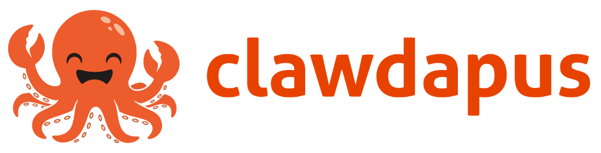
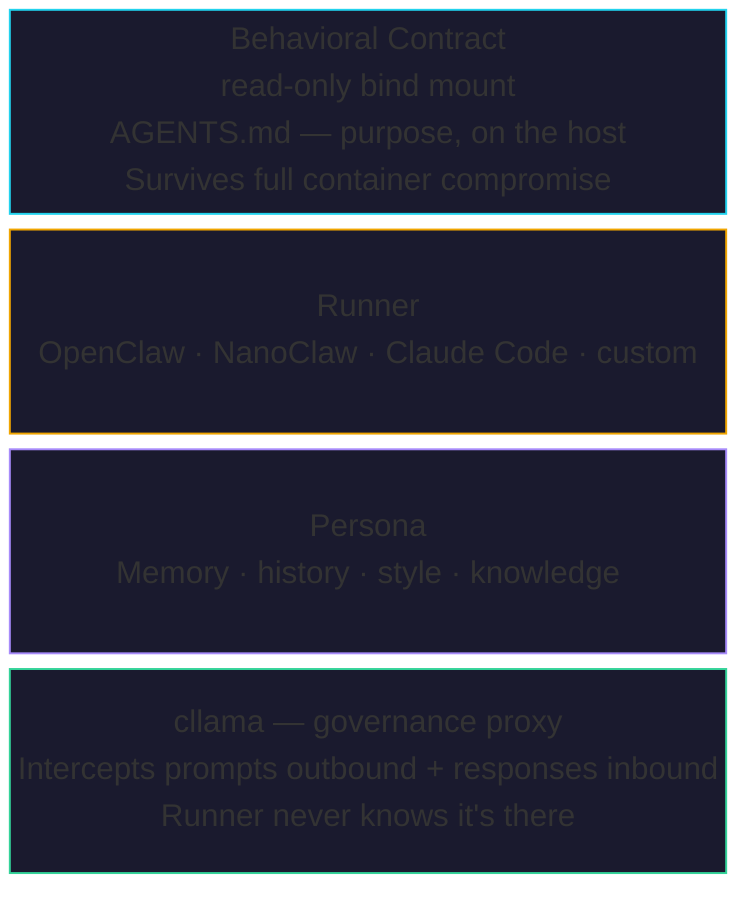

# 


**Infrastructure-layer governance for AI agent containers.**

[Documentation](https://clawdapus.dev/) | [Quickstart](https://clawdapus.dev/guide/quickstart) | [Manifesto](https://clawdapus.dev/manifesto)

> Swarm is for agents that work *for* you. Clawdapus is for bots that work *as* you.

Every agent framework answers the same question: how do I make agents collaborate? Swarm, CrewAI, LangGraph — all application-layer orchestration, all built on a shared assumption: **the agent is a trusted process.**

That assumption holds for autonomous assistants. It breaks the moment you deploy bots that operate publicly — posting to feeds, replying on Discord, executing trades, and burning provider tokens — **as a persistent presence with a persistent identity.**

Clawdapus treats the agent as an untrusted workload. It is the layer below the framework, where deployment meets governance, identity projection, and strict cost containment.

---

## Quickstart (5 minutes)

**You need:** Docker Desktop, an [OpenRouter](https://openrouter.ai/) API key, and a Discord bot token + guild ID (see [Discord setup guide](./examples/quickstart/README.md#discord-bot-setup)).

```bash
# Install
curl -sSL https://raw.githubusercontent.com/mostlydev/clawdapus/master/install.sh | sh

# Clone the quickstart example
git clone https://github.com/mostlydev/clawdapus.git
cd clawdapus/examples/quickstart

# Configure
cp .env.example .env
# Edit .env — add OPENROUTER_API_KEY, DISCORD_BOT_TOKEN, DISCORD_BOT_ID, DISCORD_GUILD_ID

# Build and launch
source .env
claw build -t quickstart-assistant:latest ./agents/assistant
claw up -f claw-pod.yml -d

# Verify
claw ps -f claw-pod.yml        # assistant + cllama both running
claw health -f claw-pod.yml    # both healthy

# Run any docker compose command against the pod
claw compose exec assistant bash
claw compose restart cllama-passthrough
claw compose top
```

The cllama governance proxy dashboard runs on port **8181** — every LLM call in real time: which agent, which model, token counts, cost.

The Clawdapus Dash fleet dashboard runs on port **8082** — live service health, topology wiring, and per-service drill-down.

On the first run, `claw build` auto-builds the local `openclaw:latest` base image if it is missing.

Message `@quickstart-bot` in your Discord server. The bot responds through the proxy — it has no direct API access. The dashboard updates live.

`claw up` resolves `${...}` placeholders inside `x-claw` metadata from your shell environment and the pod-local `.env` file before it generates runtime config. You do not need to duplicate handle IDs, guild IDs, or channel IDs into service `environment:` just to make driver config generation work.

Supported x-claw placeholder forms match shell-style parameter expansion:
- `${VAR}` required
- `${VAR:-default}` default when unset or empty
- `${VAR-default}` default when unset
- `${VAR:?message}` fail when unset or empty
- `${VAR?message}` fail when unset
- `${VAR:+value}` substitute `value` when set and non-empty
- `${VAR+value}` substitute `value` when set

Built-in x-claw variables:
- `REPO_ROOT` defaults to the pod directory passed to `claw up`

This placeholder expansion is specific to `x-claw` metadata. Standard Compose fields still use normal Docker Compose `.env` interpolation rules.

For multi-agent pods, declare shared chat topology once under `x-claw.handles-defaults` and keep each service's `x-claw.handles` block focused on service-specific identity such as bot ID and username.

See [`examples/quickstart/`](./examples/quickstart/) for the full walkthrough, Telegram/Slack alternatives, and migration from existing OpenClaw.

Or scaffold from scratch:

```bash
claw init my-pod
cd my-pod
cp .env.example .env
source .env
claw build -t my-pod-assistant:latest ./agents/assistant
claw up -d

# add another agent later
claw agent add researcher
```

`claw agent add` preserves the project's existing layout by default:
- Canonical project: adds `agents/<name>/Clawfile` + `agents/<name>/AGENTS.md`
- Flat project: adds `Clawfile.<name>` + `AGENTS-<name>.md`

Use `--layout canonical` or `--layout flat` to override auto-detection.

---

## Install

```bash
curl -sSL https://raw.githubusercontent.com/mostlydev/clawdapus/master/install.sh | sh
claw doctor
```

Or build from source:

```bash
go build -o bin/claw ./cmd/claw
```

## Update

Clawdapus moves fast — update frequently.

```bash
claw update
```

`claw` checks for updates once an hour and prints a notice when a newer release is available.

### Install AI Skill

Give your coding agent full operational knowledge of Clawdapus — the `claw` CLI, Clawfile syntax, claw-pod.yml structure, cllama proxy wiring, driver semantics, and troubleshooting patterns.

```bash
SKILL_URL="https://raw.githubusercontent.com/mostlydev/clawdapus/master/skills/clawdapus/SKILL.md"

# Claude Code
mkdir -p ~/.claude/skills/clawdapus
curl -sSL "$SKILL_URL" -o ~/.claude/skills/clawdapus/SKILL.md

# Codex CLI
curl -sSL "$SKILL_URL" >> ~/.codex/AGENTS.md

# Gemini CLI
curl -sSL "$SKILL_URL" >> ~/.gemini/GEMINI.md

# OpenCode
curl -sSL "$SKILL_URL" >> AGENTS.md

# Cursor / Windsurf / other .cursorrules-based agents
curl -sSL "$SKILL_URL" >> .cursorrules
```

---

# Architecture

## What It Looks Like

**The Image (`Clawfile`)** — an extended Dockerfile.

```dockerfile
FROM openclaw:latest

CLAW_TYPE openclaw
AGENT AGENTS.md                   # behavioral contract — bind-mounted read-only

MODEL primary openrouter/anthropic/claude-sonnet-4
MODEL fallback anthropic/claude-haiku-3-5

CLLAMA passthrough                # governance proxy — credential starvation + cost tracking

HANDLE discord                    # platform identity — mention patterns, peer discovery
INVOKE 15 8 * * 1-5  pre-market   # scheduled invocation — cron, managed by operator

SURFACE service://trading-api     # declared capabilities — auto-discovered, skill-mapped
SURFACE volume://shared-research read-write

SKILL policy/risk-limits.md       # operator policy — mounted read-only into runner
```

**The Deployment (`claw-pod.yml`)** — an extended docker-compose.

```yaml
x-claw:
  pod: trading-desk
  master: octopus
  cllama-defaults:
    proxy: [passthrough]
    env:
      OPENROUTER_API_KEY: "${OPENROUTER_API_KEY}"
      ANTHROPIC_API_KEY: "${ANTHROPIC_API_KEY}"
  surfaces-defaults:
    - "service://trading-api"
    - "volume://shared-research read-write"
  feeds-defaults: [market-context]    # resolved from trading-api's claw.describe
services:
  tiverton:
    image: trading-desk-tiverton:latest
    build:
      context: ./agents/tiverton
    x-claw:
      agent: ./agents/tiverton/AGENTS.md
      handles:
        discord:
          id: "${TIVERTON_DISCORD_ID}"
          username: "tiverton"
      invoke:
        - schedule: "15 8 * * 1-5"
          name: "Pre-market synthesis"
          message: "Run pre-market synthesis and post the floor briefing."
          to: trading-floor
```

Services inherit `cllama-defaults`, `surfaces-defaults`, and `feeds-defaults` from the pod. Override any field to replace; use `...` spread to extend:

```yaml
    x-claw:
      skills:
        - ...                          # inherit pod defaults
        - ./policy/escalation.md       # add coordinator-only skill
```

`claw build` transpiles the Clawfile to a standard Dockerfile. `claw up` parses the pod YAML, runs driver enforcement, generates per-agent configs, wires the cllama proxy, and calls `docker compose`. The output is standard OCI images and a standard compose file. Eject from Clawdapus anytime — you still have working Docker artifacts.

---

## How It Works

Clawdapus extends two formats you already know:

| Clawdapus | Docker equivalent | Purpose |
|-----------|------------------|---------|
| `claw init` | `docker init` + project templating | Scaffold canonical-by-default project layout |
| `claw agent add` | _(none)_ | Add agents while preserving existing layout (`--layout auto|canonical|flat`) |
| `Clawfile` | `Dockerfile` | Build an immutable agent image |
| `claw-pod.yml` | `docker-compose.yml` | Run a governed agent fleet |
| `claw build` | `docker build` | Transpile + build OCI image (`--context` for separate build context) |
| `claw up` | `docker compose up` | Enforce + deploy |

Any valid Dockerfile is a valid Clawfile. Any valid `docker-compose.yml` is a valid `claw-pod.yml`. Extended directives live in namespaces Docker already ignores. Eject from Clawdapus anytime — you still have a working OCI image and a working compose file.

---

## Clawfile Directives

The Clawfile extends the Dockerfile with directives that the `claw build` preprocessor translates into standard Dockerfile primitives (`LABEL`, `ENV`, `RUN`). The output is a plain OCI image.

| Directive | Purpose |
|---|---|
| `CLAW_TYPE` | Selects the runtime driver (openclaw, hermes, nanobot, picoclaw, nanoclaw, microclaw, nullclaw) |
| `AGENT` | Names the behavioral contract file |
| `PERSONA` | Imports a persona workspace — local path or OCI artifact ref |
| `MODEL` | Binds named model slots to providers |
| `CLLAMA` | Declares governance proxy type(s) |
| `HANDLE` | Declares platform identity (discord, telegram, slack, and others per driver) |
| `INVOKE` | Scheduled invocations via cron |
| `SURFACE` | Declared in pod YAML — volumes, services, channels |
| `SKILL` | Operator policy files mounted read-only |
| `INCLUDE` | Pod-level contract composition — `enforce`, `guide`, or `reference` mode |
| `CONFIGURE` | Runner-specific config mutations at init |
| `TRACK` | Wraps package managers to log mutations |
| `PRIVILEGE` | Drops container privileges |

---

## Claw Type Support

Pick a driver based on what you need. All drivers support `MODEL`, `AGENT`, `CLLAMA`, and `CONFIGURE`.

| | `openclaw` | `hermes` | `nanoclaw` | `nanobot` | `picoclaw` | `nullclaw` | `microclaw` |
|---|:---:|:---:|:---:|:---:|:---:|:---:|:---:|
| **Runtime** | [OpenClaw](https://openclaw.ai) | [Hermes](https://github.com/NousResearch/hermes-agent) | [Claude Agent SDK](https://github.com/anthropics/claude-code) | [Nanobot](https://github.com/HKUDS/nanobot) | [PicoClaw](https://github.com/sipeed/picoclaw) | [NullClaw](https://github.com/nullclaw/nullclaw) | [MicroClaw](https://github.com/microclaw/microclaw) |
| `claw init` scaffold | ✅ | ✅ | ✅ | ✅ | ✅ | ✅ | ✅ |
| HANDLE: Discord | ✅ | ✅ | — | ✅ | ✅ | ✅ | ✅ |
| HANDLE: Telegram | — | ✅ | — | ✅ | ✅ | ✅ | ✅ |
| HANDLE: Slack | — | ✅ | — | ✅ | ✅ | ✅ | ✅ |
| HANDLE: long-tail ¹ | — | — | — | — | ✅ | — | — |
| INVOKE (cron) | ✅ | ✅ | — | ✅ | ✅ | ✅ | — |
| Structured health | ✅ | ✅ | — | — | ✅ | ✅ | — |
| Read-only rootfs | ✅ | ✅ | — | ✅ | ✅ | ✅ | — |
| Non-root container | — | — | — | — | ✅ | — | — |

¹ PicoClaw long-tail: WhatsApp, Feishu, LINE, QQ, DingTalk, OneBot, WeCom, WeCom App, Pico, MaixCam.
`claw init` scaffolds `generic` (alpine:3.20, no driver enforcement) for custom runtimes.

### OpenClaw Discord Routing Compatibility

The OpenClaw driver now maps the supported `channel://discord` routing controls directly into generated config and rejects the unsupported ones early.

| `channel://discord` map-form setting | `openclaw` |
|---|:---:|
| DM `policy` (`pairing`, `allowlist`, `open`, `disabled`) | ✅ |
| DM `allowFrom` | ✅ |
| Guild `requireMention` | ✅ |
| Guild `users[]` allowlist | ✅ |
| Surface `allow_from_handles: true` → expands into each guild `users[]` | ✅ |
| Surface `allow_from_services: [svc...]` → derives Discord IDs from service bot tokens and expands each guild `users[]` | ✅ |
| Guild `policy` | — ² |

² The current OpenClaw runtime rejects guild-level `policy`; Clawdapus now fails during config generation instead of writing a config the container will reject at boot.

---

## Nullclaw `CONFIGURE` Examples

Use these when you want high-level `HANDLE` defaults, but need runtime-specific policy details.

```dockerfile
# Base identity on a platform:
HANDLE discord

# "Can talk on" -> pin to one guild/server
CONFIGURE nullclaw config set channels.discord.accounts.main.guild_id "123456789012345678"

# "Can talk to" -> require mention in group chats
CONFIGURE nullclaw config set channels.discord.accounts.main.require_mention true

# Telegram allowlist for DMs
CONFIGURE nullclaw config set channels.telegram.accounts.main.allow_from ["111111111","222222222"]

# Slack transport mode selection
CONFIGURE nullclaw config set channels.slack.accounts.main.mode "socket"
```

Notes:
- `CONFIGURE` is driver-side DSL here (`nullclaw config set <path> <value>`), applied to generated `config.json`.
- Values are parsed as JSON when possible: booleans/numbers/arrays/objects should be unquoted; strings should be quoted.
- `CONFIGURE` runs after defaults, so it overrides what `HANDLE` generated.

---

## The Anatomy of a Claw


```mermaid
block-beta
  columns 1
  contract["Behavioral Contract\nread-only bind mount\nAGENTS.md — purpose, on the host\nSurvives full container compromise"]
  runner["Runner\nOpenClaw · NanoClaw · Claude Code · custom"]
  persona["Persona\nMemory · history · style · knowledge"]
  proxy["cllama — governance proxy\nIntercepts prompts outbound + responses inbound\nRunner never knows it's there"]

  style contract fill:#1a1a2e,stroke:#22d3ee,color:#eee
  style runner fill:#1a1a2e,stroke:#f0a500,color:#eee
  style persona fill:#1a1a2e,stroke:#a78bfa,color:#eee
  style proxy fill:#1a1a2e,stroke:#34d399,color:#eee
```

The contract lives on the host. Even a root-compromised runner cannot rewrite its own mission. Swap runners without touching identity. Add or remove the governance proxy without rebuilding anything.

---

## cllama: The Governance Proxy

When a reasoning model tries to govern itself, the guardrails are part of the same cognitive process they're trying to constrain. `cllama` is a **separate process** sitting between the runner and the LLM provider. The runner thinks it's talking directly to the model. It never sees the proxy.

- **Credential starvation:** The proxy holds the real API keys. Agents get unique bearer tokens. No credentials, no bypass.
- **Identity resolution:** Single proxy serves an entire pod. Bearer tokens resolve which agent is calling.
- **Cost accounting:** Extracts token usage from every response, multiplies by pricing table, tracks per agent/provider/model.
- **Audit logging:** Structured JSON on stdout — timestamp, agent, model, latency, tokens, cost, intervention reason.
- **Planned ambient memory:** The architecture is moving toward querying pluggable memory services before each inference turn, injecting relevant derived context — facts, commitments, summaries — into the prompt automatically. Memory intelligence will live in swappable services, not in the proxy.
- **Operator dashboard:** Real-time web UI at host port 8181 by default (container `:8081`) — agent activity, provider status, cost breakdown.

The reference implementation is [`cllama`](https://github.com/mostlydev/cllama) — a zero-dependency Go binary that implements the transport layer (identity, routing, cost tracking). Future proxy types (`cllama-policy`) will add bidirectional interception: evaluating outbound prompts and amending inbound responses against the agent's behavioral contract.

See the [cllama specification](./docs/CLLAMA_SPEC.md) for the full standard.

---

## Social Topology

```bash
# Available in every pod service automatically:
CLAW_HANDLE_CRYPTO_CRUSHER_DISCORD_ID=123456789
CLAW_HANDLE_CRYPTO_CRUSHER_DISCORD_GUILDS=111222333
```

`HANDLE discord` in a Clawfile declares the agent's platform identity. Clawdapus broadcasts every agent's handles as env vars into every service in the pod — including non-claw services. A trading API that needs to mention a bot in a webhook message knows its Discord ID without hardcoding anything.

The driver also wires each agent's openclaw config automatically: `allowBots: true` (enables bot-to-bot messaging), `mentionPatterns` derived from the handle username and ID (so agents can route incoming messages correctly), and a guild `users[]` allowlist that includes every peer bot in the pod.

When many services share the same Discord guild/channel topology, put that shared topology in pod-level `x-claw.handles-defaults` and let per-service `handles.discord` override only the identity fields that differ.

---

## Compilation Principles

`claw up` is a compiler. It reads the pod file, inspects images, and emits deterministic runtime artifacts. These principles govern the compilation pipeline:

1. **Compile-time, not runtime.** All wiring — feeds, skills, identity, surfaces — is resolved during `claw up`. No runtime self-registration. The generated compose file is the single source of truth for what's deployed.

2. **Provider-owns, consumer-subscribes.** Services declare what they offer (feeds, endpoints, auth). Agents subscribe by name. The consumer should never need to know a service's URL path or TTL — that's the provider's concern.

3. **Pod-level defaults, service-level overrides.** Anything shared across most services — proxy config, surfaces, feeds, skills — is declared once at pod level. Services inherit by default and override or extend as needed.

4. **One canonical descriptor.** A service's capabilities, feeds, and endpoints are declared once (via `claw.describe` in the image) and projected into whatever artifacts need them — CLAWDAPUS.md, feed manifests, effective agent contracts.

5. **Services self-describe.** Images can carry a structured descriptor (`LABEL claw.describe=...`) that advertises feeds provided, auth requirements, and a skill file. `claw up` extracts and compiles these into the pod. Framework-specific adapters (e.g., RailsTrail for Rails apps) can generate descriptors from code introspection.

---

## Surfaces, Skills, and CLAWDAPUS.md

Every Claw receives a generated `CLAWDAPUS.md` — the single context document listing surfaces, mount paths, peer handles, feeds, and available skills. Service descriptions from `claw.describe` labels or `claw.skill.emit` are inlined directly into CLAWDAPUS.md surface sections, so workflow-critical API docs are always in prompt context without extra pod YAML. Add a service, the skill map updates. No code changes.

```bash
$ claw skillmap crypto-crusher-0

  FROM market-scanner (service://market-scanner):
    get_price            Current and historical token price data
    get_whale_activity   Large wallet movements in last N hours
    [discovered via OpenAPI → skills/surface-market-scanner.md]

  FROM shared-cache (volume://shared-cache):
    read-write at /mnt/shared-cache
```

---

## Examples

| Example | What it shows |
|---------|---------------|
| [`examples/quickstart/`](./examples/quickstart/) | **Start here** — single governed agent with Discord, cllama proxy, and dashboard |
| [`examples/openclaw/`](./examples/openclaw/) | Single OpenClaw agent with Discord handle, skill emit, and service surface |
| [`examples/nanobot/`](./examples/nanobot/) | Minimal Nanobot driver project with generated config + Discord handle wiring |
| [`examples/picoclaw/`](./examples/picoclaw/) | Minimal PicoClaw driver project with model-list config + Discord handle wiring |
| [`examples/multi-claw/`](./examples/multi-claw/) | Two agents sharing a volume surface with different access modes |
| [`examples/trading-desk/`](./examples/trading-desk/) | Three agents coordinating via Discord with a mock trading API, scheduled invocations, desk-wide risk feeds, and cllama governance proxy |
| [`examples/rollcall/`](./examples/rollcall/) | All 7 drivers sharing one Discord identity — driver parity fixture and end-to-end cllama validation |

---

## The Master Claw (The Top Octopus)

Clawdapus is designed for autonomous fleet governance. The operator writes the `Clawfile` and sets the budgets, but day-to-day oversight can be delegated to a **Master Claw** — an AI governor.

**The Governance Proxy is its Sensory Organ:**
The `cllama` proxy is the programmatic choke point. It sits on the network, enforces the hard rules (rate limits, budgets, PII blocking), and emits structured telemetry logs (drift, cost, interventions). It doesn't "think" about management; it is a passive sensor and firewall.

**The Master Claw is the Brain:**
The Master Claw is an actual LLM-powered agent running in the pod, tasked with reading proxy telemetry. If a proxy reports an agent drifting, burning budget, or failing policy checks, the Master Claw makes an executive decision to dynamically shift budgets, promote recipes, or quarantine the drifting agent.

In enterprise deployments, this naturally forms a **Hub-and-Spoke Governance Model**. Multiple pods across different zones have their own `cllama` proxies acting as local firewalls, while a single Master Claw ingests telemetry from them all to autonomously manage the entire neural fleet.

---

## Fleet Visibility (Design — Phase 5)

```bash
$ claw ps

TENTACLE          STATUS    CLLAMA    DRIFT
crypto-crusher-0  running   healthy   0.02
crypto-crusher-1  running   healthy   0.04
crypto-crusher-2  running   WARNING   0.31

$ claw audit crypto-crusher-2 --last 24h

14:32  tweet-cycle       OUTPUT MODIFIED by cllama:policy  (financial advice detected)
18:01  engagement-sweep  OUTPUT DROPPED by cllama:purpose  (off-strategy)
```

Drift is independently scored — not self-reported. The structured logs from `cllama` provide the raw telemetry today; the `claw audit` command and drift scoring are Phase 5.

---

## Recipe Promotion (Planned — Phase 6)

```bash
$ claw recipe crypto-crusher-0 --since 7d

  pip: tiktoken==0.7.0, trafilatura>=0.9
  apt: jq
  files: scripts/scraper.py

Apply?  claw bake crypto-crusher --from-recipe latest
```

Bots install things. That's how real work gets done. Tracked mutation is evolution. Untracked is drift. Ad hoc capability-building becomes permanent infrastructure through a human gate.

---

## Core Principles

1. **Purpose is sacred** — contract is bind-mounted read-only; survives full container compromise
2. **The workspace is alive** — bots install and adapt; mutations are tracked and promotable
3. **Configuration is code** — every deviation from defaults is diffable
4. **Drift is an open metric** — independent audit via the governance proxy, not self-report
5. **Surfaces are declared** — topology for operators; capability discovery for bots. The proxy enforces cognitive boundaries.
6. **Claws are users** — standard credentials; the proxy governs intent, the service's own auth governs execution
7. **Compute is a privilege** — operator assigns models and schedules; proxy enforces budgets and rate limits; bot doesn't choose
8. **Think twice, act once** — a reasoning model cannot be its own judge
9. **Memory survives the container (and the runner)** — session history is captured at the proxy boundary and persisted outside the runtime directory. Bots don't start amnesia-fresh after every restart. Infrastructure owns the record; the runner owns the scratch space. Two surfaces, two owners, never merged. Because the architecture is the agent, you can swap the runtime (`CLAW_TYPE`) without losing the mind; knowledge seamlessly crosses driver boundaries. Retention is only half of memory. The architecture is moving toward an **ambient memory plane**: pluggable memory services deriving durable state from the retained record, and the proxy recalling relevant context into future inference turns automatically. The agent would not manage its own long-term memory — infrastructure would.

---

## Status

**v0.3.2 released** — [download](https://github.com/mostlydev/clawdapus/releases/tag/v0.3.2)

| Phase | Status |
|-------|--------|
| Phase 1 — Clawfile parser + build | Done |
| Phase 2 — Driver framework + pod runtime + OpenClaw + volume surfaces | Done |
| Phase 3 — Surface manifests, service skills, CLAWDAPUS.md | Done |
| Phase 3.5 — HANDLE directive + social topology (Discord, Telegram, Slack) | Done |
| Phase 3.6 — INVOKE scheduling + Discord config wiring | Done |
| Phase 3.7 — Social topology: mentionPatterns, allowBots, peer handle users | Done |
| Phase 3.8 — Channel surface bindings | Done |
| Phase 4 — Shared governance proxy integration + credential starvation | Done |
| Phase 4.5 — Interactive claw init & claw agent add (canonical layout) | Done |
| Phase 4.7 — Nanobot + PicoClaw + NullClaw + MicroClaw drivers | Done |
| Phase 4.8 — Hermes driver + shared helper extraction | Done |
| Phase 4.9 — Peer handles, mention safety, healthcheck passthrough | Done |
| Phase 4.6 — Unified worker architecture (config, provision, diagnostic) | Design |
| Phase 5 — Fleet governance: Master Claw, telemetry, context feeds | Design (ADRs 012–015) |
| Phase 6 — Recipe promotion + worker mode | Planned |

---

## Documentation

- [`MANIFESTO.md`](./MANIFESTO.md) — vision, principles, full architecture
- [`docs/plans/2026-02-18-clawdapus-architecture.md`](./docs/plans/2026-02-18-clawdapus-architecture.md) — implementation plan
- [`docs/CLLAMA_SPEC.md`](./docs/CLLAMA_SPEC.md) — Standardized Sidecar interface for policy and compute metering
- [`docs/decisions/001-cllama-transport.md`](./docs/decisions/001-cllama-transport.md) — ADR: cllama as sidecar HTTP proxy
- [`docs/decisions/002-runtime-authority.md`](./docs/decisions/002-runtime-authority.md) — ADR: compose-only lifecycle authority
- [`docs/decisions/003-topology-simplification.md`](./docs/decisions/003-topology-simplification.md) — ADR: Topology simplification and the HANDLE directive
- [`docs/decisions/004-service-surface-skills.md`](./docs/decisions/004-service-surface-skills.md) — ADR: Service surface skills strategy
- [`docs/decisions/006-invoke-scheduling.md`](./docs/decisions/006-invoke-scheduling.md) — ADR: INVOKE scheduling mechanism
- [`docs/decisions/007-llm-isolation-credential-starvation.md`](./docs/decisions/007-llm-isolation-credential-starvation.md) — ADR: LLM Isolation via Credential Starvation
- [`docs/decisions/008-cllama-sidecar-standard.md`](./docs/decisions/008-cllama-sidecar-standard.md) — ADR: cllama as a Standardized Sidecar Interface
- [`docs/decisions/009-contract-composition-and-policy.md`](./docs/decisions/009-contract-composition-and-policy.md) — ADR: Contract Composition and Policy Inclusion
- [`docs/decisions/010-cli-surface-simplification.md`](./docs/decisions/010-cli-surface-simplification.md) — ADR: CLI Surface Simplification (`claw compose *` → `claw *`)
- [`docs/decisions/011-canonical-project-layout.md`](./docs/decisions/011-canonical-project-layout.md) — ADR: Canonical-By-Default Scaffold Layout
- [`docs/decisions/012-master-claw-fleet-governance.md`](./docs/decisions/012-master-claw-fleet-governance.md) — ADR: Master Claw and Fleet Governance
- [`docs/decisions/013-context-feeds.md`](./docs/decisions/013-context-feeds.md) — ADR: Context Feeds — Live Data Injection for Claws
- [`docs/decisions/014-telemetry-normalization-and-audit.md`](./docs/decisions/014-telemetry-normalization-and-audit.md) — ADR: Telemetry Normalization and `claw audit`
- [`docs/decisions/015-claw-api-authentication-and-scoping.md`](./docs/decisions/015-claw-api-authentication-and-scoping.md) — ADR: `claw-api` Authentication and Authorization Scoping
- [`docs/decisions/016-canonical-social-identity-and-conformance-spikes.md`](./docs/decisions/016-canonical-social-identity-and-conformance-spikes.md) — ADR: Canonical Social Identity and Conformance Spikes
- [`docs/decisions/017-pod-defaults-and-service-self-description.md`](./docs/decisions/017-pod-defaults-and-service-self-description.md) — ADR: Pod-Level Defaults and Service Self-Description (`claw.describe`, provider-owned feeds)
- [`docs/decisions/018-session-history-and-memory-retention.md`](./docs/decisions/018-session-history-and-memory-retention.md) — ADR: Session History and Persistent Memory Surfaces (two surfaces, two owners, phase model)
- [`docs/UPDATING.md`](./docs/UPDATING.md) — checklist of everything to update when implementation changes
- [`TESTING.md`](./TESTING.md) — unit, E2E, and spike test runbook

## Contributing

Start with [`MANIFESTO.md`](./MANIFESTO.md) before contributing.
