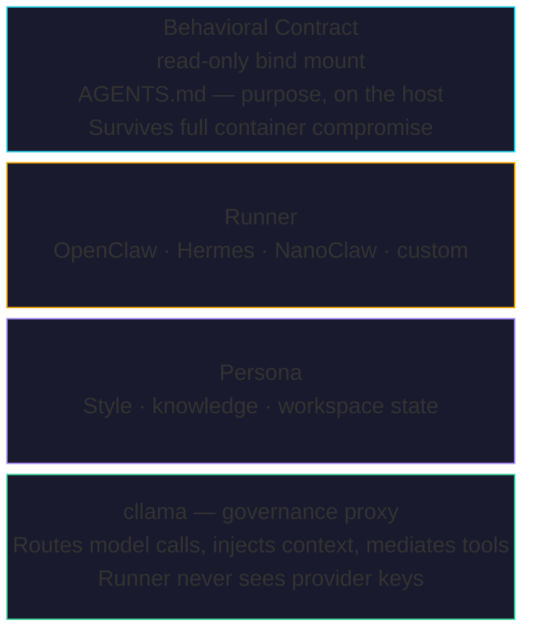

# The Anatomy of a Claw

A running Claw splits cognition into two independent layers: **internal execution** and **external governance**. Every Claw is built from four components -- three mandatory, one optional -- that are independently versioned, independently deployable, and independently auditable.



## The Runner

The runner is the application code that implements the agent loop: receive input, assemble context, call a model, execute tools. Clawdapus does not care how the runner works internally -- it treats all runners the same way.

Supported runners today:

| Driver | Runtime |
|--------|---------|
| `openclaw` | [OpenClaw](https://openclaw.ai) |
| `hermes` | [Hermes](https://github.com/NousResearch/hermes-agent) |
| `nanobot` | [Nanobot](https://github.com/HKUDS/nanobot) |
| `picoclaw` | [PicoClaw](https://github.com/sipeed/picoclaw) |

Pick a runner based on what you need. Swap it without touching the persona or the contract. A 400-line Python script with brokerage API access needs the exact same purpose contract and governance proxy as a massive agent OS.

## The Behavioral Contract

The behavioral contract is the single most important file in the architecture. It is the bot's purpose, defined by the operator, delivered as a **read-only bind mount** from the host. Even if the container is fully compromised -- root access -- the contract remains untouchable.

::: warning The Contract Lives on the Host
The contract file (typically `AGENTS.md`) is bind-mounted read-only into the container. The bot reads its purpose on every invocation but cannot alter the constraint document itself. If the contract is not present at boot, the container does not start.
:::

### Contract Composition

Operators can provide a single monolithic contract file, or modularize it using `INCLUDE` directives in the pod manifest. Inclusions have three semantic modes that control how content reaches the agent:

- **`enforce`** -- Hard constraints and mandatory rules (e.g., risk limits, compliance boundaries). These are **deterministically concatenated** into the final read-only contract. The agent sees them on every invocation as part of its core instructions. There is no ambiguity -- enforce content is law.
- **`guide`** -- Strong recommendations and procedural workflows (e.g., escalation procedures, preferred trading strategies). Also **inlined into the contract**, so the agent sees them in prompt context. The distinction from `enforce` is semantic: guides are strong recommendations, not hard constraints. Operators use the separation to signal intent to future governance layers.
- **`reference`** -- Informational context, playbooks, and documentation. These are **NOT inlined** into the contract, saving tokens. Instead, they are mounted as read-only files in the runner's skill directory, where the agent can read them on demand. Use `reference` for large bodies of context that the agent needs access to but does not need in every prompt -- API documentation, historical playbooks, onboarding guides.

```yaml
# In claw-pod.yml
x-claw:
  include:
    - enforce: ./policy/risk-limits.md        # always in prompt
    - enforce: ./policy/compliance.md         # always in prompt
    - guide: ./procedures/escalation.md       # always in prompt (recommendation)
    - reference: ./docs/api-playbook.md       # mounted as skill file (on-demand)
    - reference: ./docs/market-primer.md      # mounted as skill file (on-demand)
```

The `enforce` and `guide` content is inlined into the generated `AGENTS.md` that the runner reads. The `reference` content appears in the agent's `CLAWDAPUS.md` as a skill index entry pointing to the mounted file, so the agent knows it exists and can read it when needed.

## The Persona

A persona is a complete, portable, forkable workspace package that encapsulates everything a bot needs to *be someone*. Not just a name and a system prompt -- a full identity with memory, interaction history, stylistic fingerprint, and knowledge base.

Personas are the content layer. They grow during operation and can be snapshotted.

::: tip Swap the runner, keep durable state
Clawdapus keeps infrastructure-owned session history outside the runtime and preserves runner-owned portable memory under `.claw-memory/`. That makes driver migrations possible without throwing away the retained record or the runner's scratch memory. Persona materialization is a separate local/OCI import path layered into the runtime when configured.
:::

::: tip Personas are Portable
A persona can be a local directory path or an OCI artifact reference. Download one, fork it, deploy it under a different contract. The persona is the identity; the contract is the mission.
:::

### Persona Forking

Snapshot a running Claw that has accumulated months of memory, interaction history, and knowledge. Fork it. Deploy the fork with a different behavioral contract. You now have two bots that share history and knowledge but differ in purpose.

This is the key distinction between the persona and the contract: the contract is the mission (static, operator-defined, read-only), while the persona is the identity (dynamic, growing, forkable). A trading analyst that has learned market patterns over six months can be forked into a risk monitor -- same knowledge base, different mandate.

The `PERSONA` directive in the Clawfile imports a persona workspace. Local refs are copied with traversal and symlink hardening. Non-local refs are pulled as OCI artifacts. At runtime, the persona directory is mounted into the container and `CLAW_PERSONA_DIR` is set so the runner knows where to find it.

## cllama: The Governance Proxy

The fourth component is optional but transformative. `cllama` is an independent process that sits between the runner and the LLM provider. The runner thinks it is talking directly to the model. It never sees the proxy.

- The proxy holds the real API keys. Agents get unique bearer tokens. No credentials, no bypass.
- A single proxy serves an entire pod. Bearer tokens resolve which agent is calling.
- Every LLM call is logged: timestamp, agent, model, latency, tokens, cost.

The key insight: **a reasoning model cannot be its own judge.** Prompt-level guardrails are part of the same cognitive process they are trying to constrain. Governance must be executed by a separate, independent process.

Read more in the dedicated [cllama guide](/guide/cllama) for proxy architecture, credential starvation mechanics, and the audit pipeline.

## The Key Insight

These four components are independently versioned, independently deployable, and independently auditable:

- Swap the **runner** without touching identity or governance.
- Swap the **persona** without touching the contract or the proxy.
- Update the **contract** without rebuilding anything -- it is a text file on the host.
- Add or remove the **governance proxy** without changing the runner or the persona.

This separation is what makes Clawdapus governance durable. No single component failure can compromise the entire stack. A compromised runner cannot rewrite its own mission. A changed contract does not require a new image. The proxy can be upgraded independently of everything it governs.
